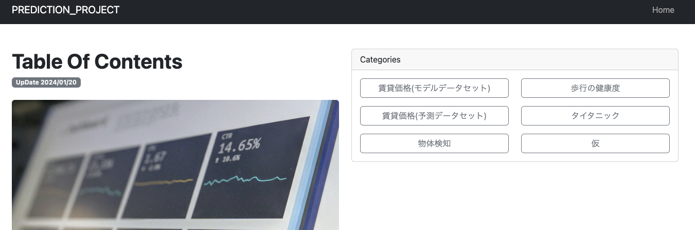
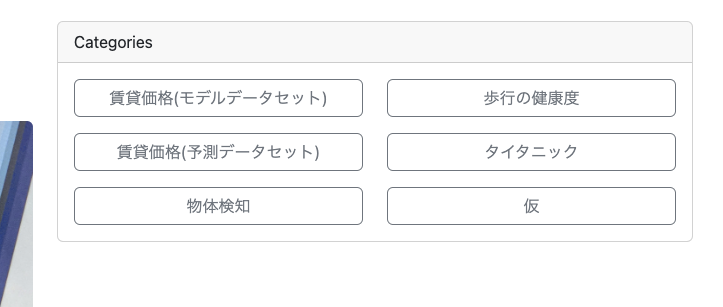

# プロジェクト名：　prediction_project

# 概要

```
様々なモデルを使用し予測アプリを作成
```
### アプリ機能面について


- [賃貸価格(モデルデータセット)](./notoboke/housing_model.ipynb)
- [賃貸価格(予測データセット)](./notoboke/housing_list.ipynb)
- [物体検知アプリ](./notoboke/obj_detection.ipynb)
- 歩行の健康度(作成中)
- タイタニック(作成中)
- 仮（模索中...）


# 開発環境構築
- [Python環境設定について](./document/01_Python環境構築.md)
- [Pythonライブラリについて](./document/02_Pythonライブラリ.md)
- [VScode(統合開発環境)について](./document/03_VScodeでの機能拡張.md)

# Djangoの導入
- [Djangoプロジェクト作成について](./document/04_Djangoプロジェクト作成.md)

# アプリ作成
- [アプリ作成について](./document/05_アプリ作成について.md)

# DjangoのMVCモデル
- [MVCモデルについて](./document/06_MVCモデル.md)

# フォーム作成について
- [Djangoのフォーム作成](./document/07_フォーム作成について.md)

# Pythonによる機械学習について
- [機械学習について](./document/08_機械学習.md)