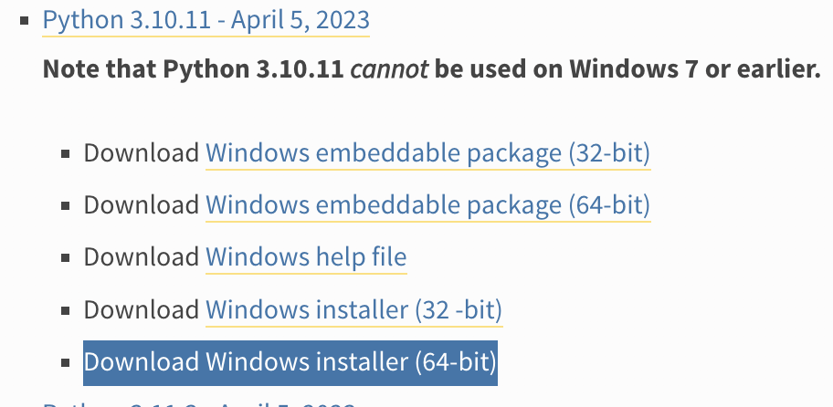
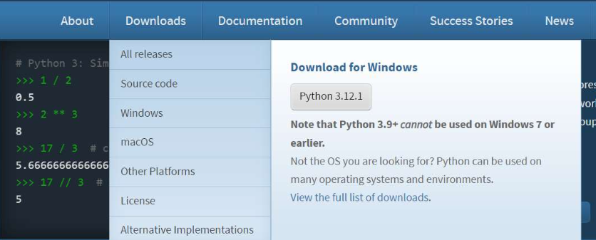
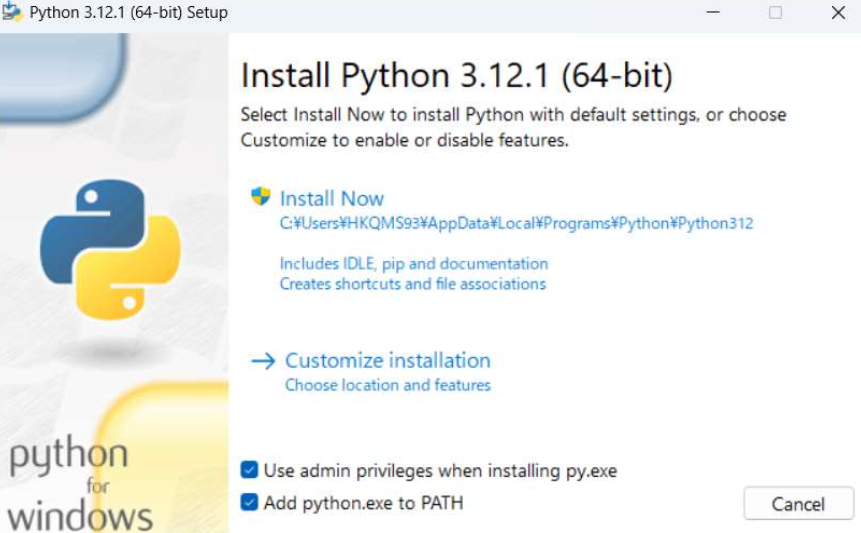
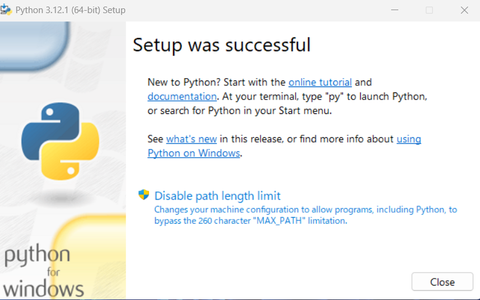
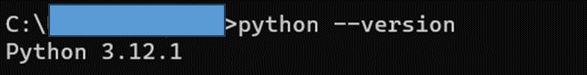

# 【Python環境構築】

## 1.Python3.10.11のダウンロード
- 下記のURLにアクセスする
```
https://www.python.org/downloads/windows/
```

- ページ内の「Python 3.10.11 - April 5, 2023」の「Download Windows installer (64-bit)」押下するとダウンロードされる。


- または、下記のURLをクリックするとダウンロードされる。
```
https://www.python.org/ftp/python/3.10.11/python-3.10.11-amd64.exe
```

### 【備考】
今回紹介するアプリにて、画像の機械学習で使用するultralyticsが最新版だとインストールされない事がある為、最新版ではなくPython3.10.11をインストールする事にした。


### 最新版のダウンロードの場合
- 下記のURLにアクセスする
```
https://www.python.org/
```
- Download
  - Downlod for windowsの下の「Python3.xx.x」 を押下
  - ファイルがダウンロードされ、ダウンロード先のディレクトリに保存される


## 2.インストーラー起動
- ダウンロードされたインストーラーを起動


- 「Setup was successful」と画面に表示されたら、インストール完了。「Close」を押下


## Python動作確認
- コマンドプロントを起動し、以下のコマンドを入力
```
python --version
```

- 上記の様にバージョンが表示されたらダウンロード完了
