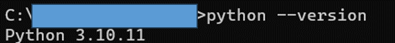

# 【Python環境構築】

## 1.ダウンロード
- 下記のURLにアクセスする
```
https://www.python.org/
```

- Download
  - Downlod for windowsの下の「Python3.xx.x」 を押下
  - ファイルがダウンロードされ、ダウンロード先のディレクトリに保存される


## 2.インストーラー起動
- ダウンロードされたインストーラーを起動


- 「Setup was successful」と画面に表示されたら、インストール完了。「Close」を押下


## Python動作確認
- コマンドプロントを起動し、以下のコマンドを入力
```
python --version
```

- 上記の様にバージョンが表示されたらダウンロード完了
