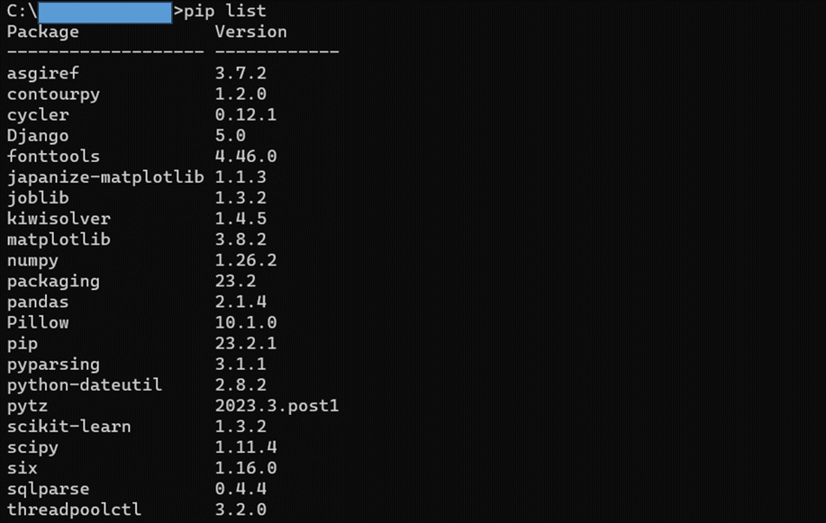

# Pythonライブラリのインストール

- ライブラリのインストールコマンド
```
pip install [ライブラリ名]
```

- Djnagoのライブラリをインストール
```
pip install django
```

- 統計および機械学習で必要なライブラリをインストール
```
pip install numpy
pip install pandas
pip install scikit-learn
pip install matplotlib
pip install japanize-matplotlib pip install jupyter
```

- インストール済みライブラリの一覧表示
```
pip list
```
