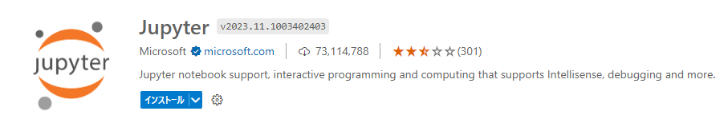

# 【統合開発環境(VScode)での機能拡張】

今回、統合開発環境はVisual Studio Codeを使用。
 
開発にあたり、以下の機能拡張を導入

## Python
- Python言語のサポート機能

## Jupyter
- VSCode上でJupyter Notebookを開く事が可能

## Django
- VSCodeでDjangoフレームワークを使って開発を行う際に導入
