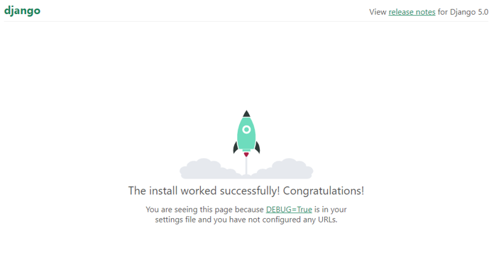

# 【Djangoプロジェクト作成】

## Djangoのプロジェクト作成からローカルブラウザに表示する手順

1.プロジェクト作成
```
django-admin startproject [プロジェクト名]
```

2.作成されたプロジェクトのディレクトリ内に移動
```
cd [プロジェクト名]
```

3.Djangoのローカルサーバを立ち上げる
```
python manage.py runserver
```

4.ローカルホストにアクセス
```
http://localhost:8000/
```

<br>
上記の様に表示されたら成功
