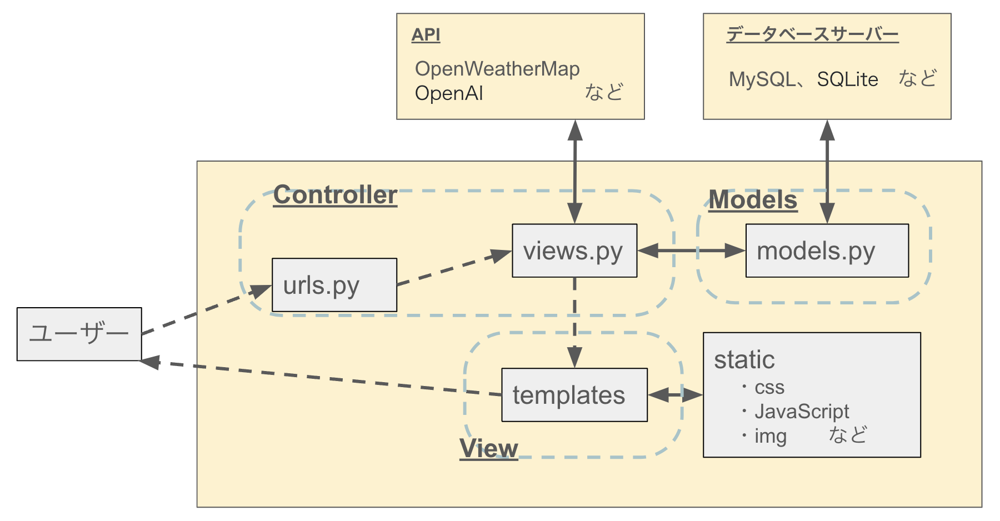

# [DjangoのMVCモデルについて]

- イメージ図

## Model(models.py)
- データベースやファイルなどのデータ管理
- データの取得・更新・削除などの処理を実施
  
## View(templates)
- views.pyに定義された関数が、URLパターンに応じたビューとして呼び出される
- HTML、CSS、JavaScriptなどのファイルをレンタリングし、画面表示

## Controller(urls.py、views.py)
- urls.pyでURLパターンを定義
- views.pyで関数を呼び出しModelとデータのやり取りや外部APIでやり取りを行う