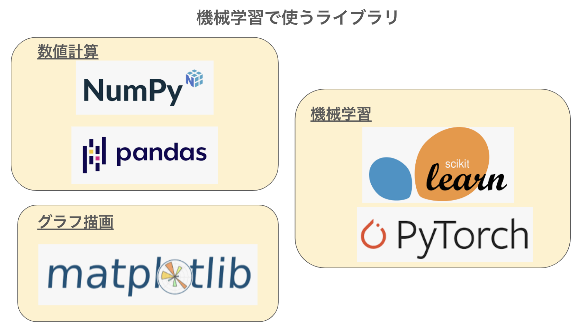

# 【機械学習とPython】

## 機械学習を行うプロセス


```
データを分析するプロジェクトでは、データの準備、データ加工、前処理、データの可視化・分析、モデリング、検証、運用という流れで進める。

データ分析の現場で大事になるのは、ビジネス理解やその目的を明確化し、PDCAサイクルを回していく必要がある。

[引用:東京大学のデータサイエンティスト育成講座,(著)塚本邦尊ら,(出版)マイナビ出版]
```


## 機械学習を行うプログラミング言語


```
機械学習を行うためには、Python、R、Java、Scala、Julia、JavaScriptなどのプログラミング言語が利用される。

その中で、Pythonは機械学習に関するライブラリが豊富であり、機械学習だけでなくWebアプリケーション開発やデータ分析、自然言語処理など、幅広い分野で利用されてている。
```

